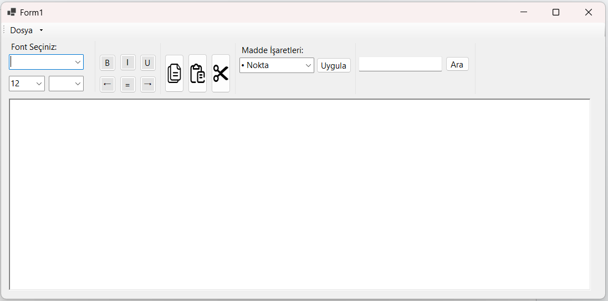

C# WinForms - Metin Editörü

Windows Forms ile geliştirilen temel metin düzenleyici.

## Özellikler
- Yazı biçimlendirme (Bold, Italic, Underline)
- Font ve renk seçimi
- Madde işaretleri
- TXT / RTF kayıt
- Arama paneli (Ctrl + F)

## Başlatmak için
Projeyi Visual Studio ile açıp çalıştırabilirsiniz.

